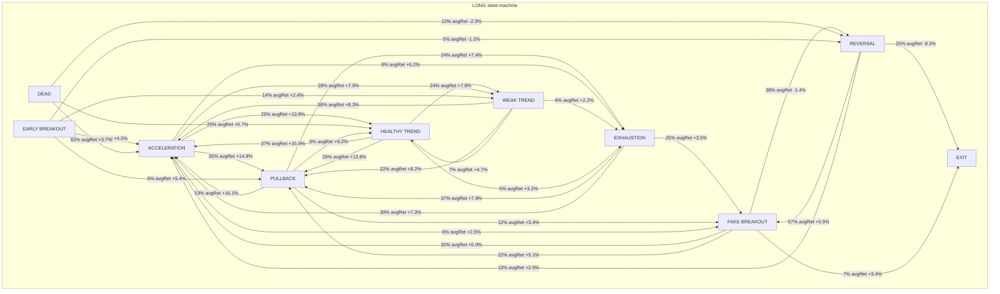
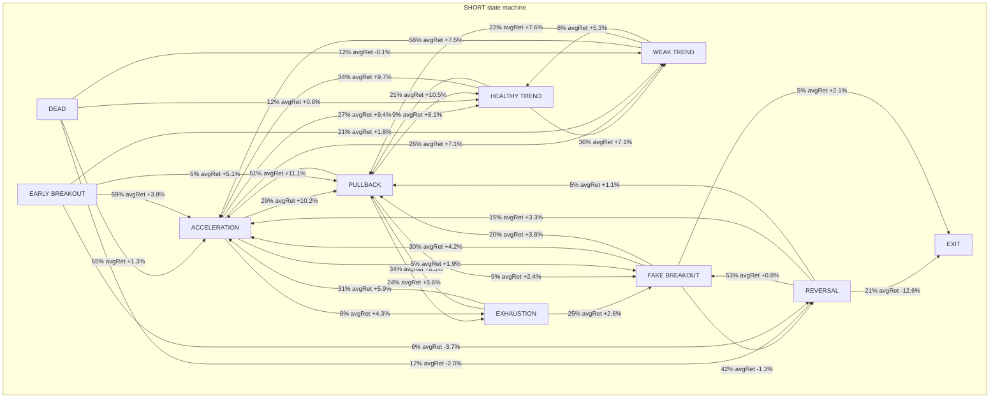

# Online State Machine V1

Post-entry **online state estimation** — no entry prediction, no price forecast.
State updates causally as each bar closes (simulated on forward bundle for research labels).

## Method

- Update cadence: **15m bars** (bundle resolution; design target was 5m)
- Features at each step: body, range, volume, ATR, momentum, slope, MFE, MAE, drawdown, acceleration
- State rules are empirical thresholds on **observable-to-date** dynamics only

## Sample

| Field | Value |
|-------|-------|
| Date range | 2026-06-01 .. 2026-06-15 |
| Scans | 180 |
| Long signals | 897 |
| Short signals | 897 |
| Timeline rows | 87906 |
| Transitions | 46401 |

## Top transitions — LONG

- PULLBACK -> ACCELERATION: P=52.52% n=2556 avgDur=27.31min avgRet=16.1274%
- ACCELERATION -> PULLBACK: P=34.87% n=2382 avgDur=18.07min avgRet=14.7953%
- ACCELERATION -> HEALTHY_TREND: P=25.01% n=1709 avgDur=19.08min avgRet=13.7519%
- ACCELERATION -> WEAK_TREND: P=17.87% n=1221 avgDur=18.53min avgRet=7.4547%
- PULLBACK -> EXHAUSTION: P=23.69% n=1153 avgDur=27.93min avgRet=7.4307%

## State statistics — LONG

| State | Obs | Avg return | Avg duration (min) | Top next |
|-------|-----|------------|------------------|----------|
| REVERSAL | 10723 | -6.2407 | 128.9 | FAKE_BREAKOUT |
| PULLBACK | 8675 | 12.9294 | 26.11 | ACCELERATION |
| ACCELERATION | 8303 | 11.5562 | 17.96 | PULLBACK |
| FAKE_BREAKOUT | 6987 | 2.5178 | 43.33 | REVERSAL |
| HEALTHY_TREND | 2736 | 12.2124 | 17.89 | ACCELERATION |
| EXHAUSTION | 2727 | 6.2653 | 19.54 | PULLBACK |
| WEAK_TREND | 2460 | 6.5044 | 18.68 | ACCELERATION |
| EARLY_BREAKOUT | 1326 | 2.8024 | 16.48 | ACCELERATION |
| DEAD | 16 | -0.0422 | 30.0 | ACCELERATION |

## Top transitions — SHORT

- PULLBACK -> ACCELERATION: P=50.91% n=2284 avgDur=30.38min avgRet=11.0795%
- ACCELERATION -> PULLBACK: P=28.9% n=2036 avgDur=17.73min avgRet=10.2228%
- ACCELERATION -> HEALTHY_TREND: P=26.85% n=1891 avgDur=18.58min avgRet=9.3541%
- ACCELERATION -> WEAK_TREND: P=25.72% n=1812 avgDur=18.82min avgRet=7.1169%
- WEAK_TREND -> ACCELERATION: P=58.17% n=1788 avgDur=18.41min avgRet=7.4635%

## State statistics — SHORT

| State | Obs | Avg return | Avg duration (min) | Top next |
|-------|-----|------------|------------------|----------|
| REVERSAL | 10414 | -8.7071 | 120.56 | FAKE_BREAKOUT |
| PULLBACK | 8638 | 9.5717 | 28.17 | ACCELERATION |
| ACCELERATION | 8483 | 8.3723 | 17.75 | PULLBACK |
| FAKE_BREAKOUT | 5295 | 1.8213 | 36.93 | REVERSAL |
| WEAK_TREND | 4071 | 6.1017 | 19.57 | ACCELERATION |
| HEALTHY_TREND | 3417 | 8.8496 | 18.76 | WEAK_TREND |
| EXHAUSTION | 2425 | 4.9997 | 19.21 | PULLBACK |
| EARLY_BREAKOUT | 1178 | 2.0831 | 16.21 | ACCELERATION |
| DEAD | 32 | -0.3077 | 28.24 | ACCELERATION |

## State transition diagram — LONG

## State transition diagram — SHORT

## Interpretation

- Transition probabilities describe **historical cohort behaviour**, not forecasts.
- Suitable for **holding-policy hypotheses** (extend in HEALTHY/ACCELERATION, tighten in EXHAUSTION/FAKE).
- Operational use requires live bar feed at intended cadence.

_Generated 2026-06-25T13:39:36.218883+09:00_
**Convergence tier:** core | trend_persistence_estimation, real_vs_fake_trend_discrimination
--- Scout Mission (convergence) ---
 Purpose: Situation Evaluation Engine + Early Trend Detection Scout
 Lifecycle: birth -> growth -> exhaustion | genuine vs fake | regime change
 Core gates: early detection | real vs fake | persistence 1h-24h | relative rank
 Research may diverge; operational output must converge
 Unknown preferred over false certainty