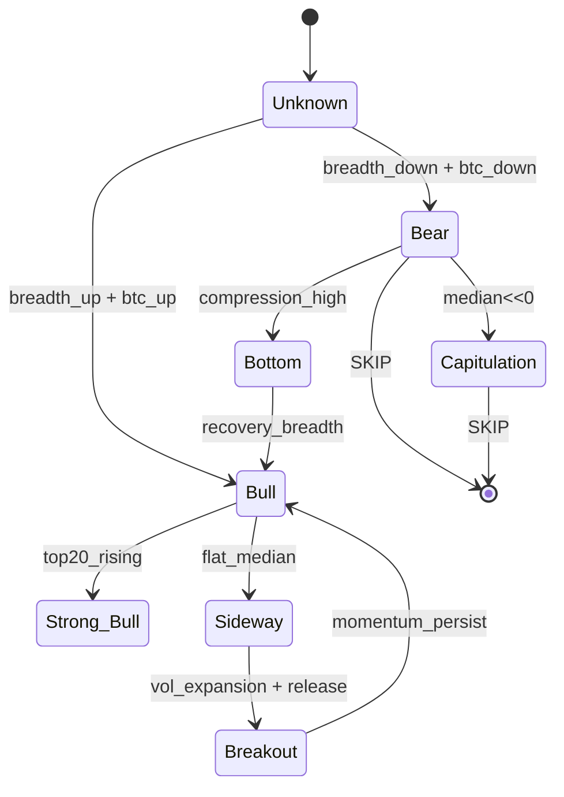

# SCOUT Regime Engine — Market State Router (Research)

Generated: 2026-06-25 11:30:45 KST
Validation scans: 180

## 1. Market States Observed
- **Sideway**: 52 scans (28.9%)
- **Bull**: 48 scans (26.7%)
- **Bear**: 28 scans (15.6%)
- **Unknown**: 21 scans (11.7%)
- **Strong_Bull**: 18 scans (10.0%)
- **Capitulation**: 11 scans (6.1%)
- **Breakout**: 1 scans (0.6%)
- **Bottom**: 1 scans (0.6%)

## 2. Regime × Engine Performance (avg2h / win% / PF / trap / drawdown)

### Bear
- FORMULA_LEAGUE: avg2h=4.3415% win=48.57% PF=7.67 trap=7.14% mdd=-2.2845% n=140
- MOMENTUM: avg2h=4.3415% win=48.57% PF=7.67 trap=7.14% mdd=-2.2845% n=140
- FEATURE_LEAGUE: avg2h=2.9564% win=27.94% PF=5.47 trap=4.41% mdd=-2.2153% n=136
- STATE_LEAGUE: avg2h=3.4144% win=40.0% PF=4.43 trap=10.71% mdd=-2.8374% n=140
- BREAKOUT: avg2h=2.9376% win=42.14% PF=2.83 trap=10.71% mdd=-4.8439% n=140
- REVERSAL: avg2h=1.0875% win=25.0% PF=1.71 trap=12.14% mdd=-3.3296% n=140
- COMPRESSION: avg2h=-0.3035% win=20.71% PF=0.89 trap=13.57% mdd=-6.0359% n=140

### Bottom
- BREAKOUT: avg2h=-1.7608% win=0.0% PF=0.0 trap=0.0% mdd=-2.1128% n=2
- COMPRESSION: avg2h=-1.7608% win=0.0% PF=0.0 trap=0.0% mdd=-2.1128% n=2
- FEATURE_LEAGUE: avg2h=-1.7608% win=0.0% PF=0.0 trap=0.0% mdd=-2.1128% n=2
- FORMULA_LEAGUE: avg2h=-1.7608% win=0.0% PF=0.0 trap=0.0% mdd=-2.1128% n=2
- MOMENTUM: avg2h=-1.7608% win=0.0% PF=0.0 trap=0.0% mdd=-2.1128% n=2
- REVERSAL: avg2h=-1.7608% win=0.0% PF=0.0 trap=0.0% mdd=-2.1128% n=2
- STATE_LEAGUE: avg2h=-1.7608% win=0.0% PF=0.0 trap=0.0% mdd=-2.1128% n=2

### Breakout
- FORMULA_LEAGUE: avg2h=9.3996% win=80.0% PF=47.0 trap=0.0% mdd=-2.1503% n=5
- MOMENTUM: avg2h=9.3996% win=80.0% PF=47.0 trap=0.0% mdd=-2.1503% n=5
- BREAKOUT: avg2h=7.5311% win=60.0% PF=37.66 trap=0.0% mdd=-3.257% n=5
- STATE_LEAGUE: avg2h=6.4853% win=60.0% PF=32.43 trap=0.0% mdd=-1.7963% n=5
- FEATURE_LEAGUE: avg2h=3.1584% win=80.0% PF=15.79 trap=0.0% mdd=-2.7682% n=5
- COMPRESSION: avg2h=1.9752% win=40.0% PF=1.71 trap=20.0% mdd=-5.0325% n=5
- REVERSAL: avg2h=0.3743% win=20.0% PF=1.25 trap=20.0% mdd=-3.7702% n=5

### Bull
- FORMULA_LEAGUE: avg2h=5.1614% win=60.42% PF=9.18 trap=7.92% mdd=-2.1374% n=240
- MOMENTUM: avg2h=5.1614% win=60.42% PF=9.18 trap=7.92% mdd=-2.1374% n=240
- STATE_LEAGUE: avg2h=4.8938% win=59.58% PF=6.83 trap=8.75% mdd=-2.5318% n=240
- FEATURE_LEAGUE: avg2h=2.9742% win=36.67% PF=7.08 trap=3.33% mdd=-1.7015% n=240
- BREAKOUT: avg2h=4.2392% win=56.25% PF=4.18 trap=8.33% mdd=-3.8898% n=240
- REVERSAL: avg2h=2.6225% win=36.25% PF=3.45 trap=6.67% mdd=-2.3393% n=240
- COMPRESSION: avg2h=1.0964% win=33.33% PF=1.41 trap=13.33% mdd=-5.8478% n=240

### Capitulation
- FEATURE_LEAGUE: avg2h=3.5547% win=43.18% PF=24.2 trap=0.0% mdd=-2.1448% n=44
- FORMULA_LEAGUE: avg2h=3.5483% win=41.82% PF=12.63 trap=3.64% mdd=-2.4609% n=55
- MOMENTUM: avg2h=3.5483% win=41.82% PF=12.63 trap=3.64% mdd=-2.4609% n=55
- STATE_LEAGUE: avg2h=2.6739% win=40.0% PF=3.94 trap=5.45% mdd=-3.2691% n=55
- BREAKOUT: avg2h=1.7577% win=36.36% PF=2.17 trap=7.27% mdd=-4.7478% n=55
- REVERSAL: avg2h=1.1631% win=25.45% PF=1.77 trap=5.45% mdd=-3.8851% n=55
- COMPRESSION: avg2h=-0.6061% win=18.18% PF=0.76 trap=7.27% mdd=-6.1323% n=55

### Sideway
- FORMULA_LEAGUE: avg2h=5.8322% win=59.62% PF=27.28 trap=1.54% mdd=-1.443% n=260
- MOMENTUM: avg2h=5.8322% win=59.62% PF=27.28 trap=1.54% mdd=-1.443% n=260
- STATE_LEAGUE: avg2h=5.3123% win=55.77% PF=9.7 trap=3.85% mdd=-2.1766% n=260
- FEATURE_LEAGUE: avg2h=3.1867% win=32.31% PF=11.15 trap=1.15% mdd=-1.4273% n=260
- REVERSAL: avg2h=2.789% win=33.85% PF=5.39 trap=2.31% mdd=-1.9222% n=260
- BREAKOUT: avg2h=4.0066% win=56.15% PF=3.28 trap=5.38% mdd=-4.6159% n=260
- COMPRESSION: avg2h=1.1327% win=34.23% PF=1.4 trap=7.69% mdd=-5.9911% n=260

### Strong_Bull
- FORMULA_LEAGUE: avg2h=6.61% win=68.89% PF=83.22 trap=1.11% mdd=-1.0053% n=90
- MOMENTUM: avg2h=6.61% win=68.89% PF=83.22 trap=1.11% mdd=-1.0053% n=90
- STATE_LEAGUE: avg2h=6.806% win=66.67% PF=79.72 trap=1.11% mdd=-1.0727% n=90
- BREAKOUT: avg2h=6.7216% win=67.78% PF=18.16 trap=3.33% mdd=-2.2008% n=90
- FEATURE_LEAGUE: avg2h=2.1095% win=24.44% PF=22.8 trap=0.0% mdd=-0.9523% n=90
- REVERSAL: avg2h=3.6947% win=42.22% PF=19.65 trap=1.11% mdd=-0.82% n=90
- COMPRESSION: avg2h=1.9762% win=40.0% PF=2.11 trap=6.67% mdd=-3.9481% n=90

### Unknown
- FEATURE_LEAGUE: avg2h=2.7614% win=34.31% PF=13.24 trap=0.98% mdd=-1.5212% n=102
- FORMULA_LEAGUE: avg2h=3.9925% win=50.48% PF=11.73 trap=5.71% mdd=-1.5802% n=105
- MOMENTUM: avg2h=3.9925% win=50.48% PF=11.73 trap=5.71% mdd=-1.5802% n=105
- STATE_LEAGUE: avg2h=3.2668% win=47.62% PF=4.76 trap=9.52% mdd=-2.556% n=105
- BREAKOUT: avg2h=2.8369% win=47.62% PF=3.46 trap=5.71% mdd=-3.7287% n=105
- REVERSAL: avg2h=2.2629% win=32.38% PF=3.46 trap=6.67% mdd=-2.2577% n=105
- COMPRESSION: avg2h=-0.2804% win=25.71% PF=0.9 trap=8.57% mdd=-5.5212% n=105

## 3. Regime Champion Engine (Router Map)
- **Bear** → `SKIP` (validation: bear regime — router policy SKIP (no new entry rules))
- **Bottom** → insufficient sample
- **Breakout** → insufficient sample
- **Bull** → `FORMULA_LEAGUE` avg2h=5.1614% win=60.42% [medium] runners=['MOMENTUM', 'STATE_LEAGUE']
- **Capitulation** → `FEATURE_LEAGUE` avg2h=3.5547% win=43.18% [hypothesis] runners=['FORMULA_LEAGUE', 'MOMENTUM']
- **Sideway** → `FORMULA_LEAGUE` avg2h=5.8322% win=59.62% [medium] runners=['MOMENTUM', 'STATE_LEAGUE']
- **Strong_Bull** → `FORMULA_LEAGUE` avg2h=6.61% win=68.89% [medium] runners=['MOMENTUM', 'STATE_LEAGUE']
- **Unknown** → `FEATURE_LEAGUE` avg2h=2.7614% win=34.31% [medium] runners=['FORMULA_LEAGUE', 'MOMENTUM']

## 4. State Transition Conditions (empirical)
- Bull → Sideway: 17 times
- Sideway → Bull: 15 times
- Unknown → Sideway: 9 times
- Sideway → Bear: 8 times
- Bear → Bull: 7 times
- Bull → Unknown: 7 times
- Bear → Sideway: 6 times
- Sideway → Unknown: 6 times
- Sideway → Strong_Bull: 5 times
- Strong_Bull → Sideway: 5 times
- Sideway → Capitulation: 5 times
- Bull → Bear: 5 times

## 5. LIVE Regime Detection Rule Candidates
Top single-signal rules (precision/recall on validation labels):
- `R_SIDEWAY_FLAT`: median_1h abs_lt 0.4 → Sideway | P=0.867 R=1.0 F1=0.929
- `R_CAPITULATION`: median_1h <= -1.5 → Capitulation | P=0.846 R=1.0 F1=0.917
- `R_BREADTH_WIDE`: breadth_positive_1h >= 0.55 → Bull | P=0.646 R=0.875 F1=0.743
- `R_BREADTH_NARROW`: breadth_positive_1h < 0.35 → Bear | P=0.595 R=0.893 F1=0.714
- `R_BTC_TREND_BULL`: btc_1h >= 0.5 → Bull | P=0.661 R=0.771 F1=0.712
- `R_BTC_TREND_BEAR`: btc_1h < -0.5 → Bear | P=0.528 R=1.0 F1=0.691
- `R_RELEASE_ACTIVE`: median_release >= 0.12 → Breakout | P=0.333 R=1.0 F1=0.5
- `R_TOP20_RISING`: top20_positive_pct >= 0.6 → Strong_Bull | P=0.286 R=1.0 F1=0.444

Composite router proposals (not LIVE-applied):
- `COMPOSITE_BULL_ROUTER`: if btc_1h>=0.5 AND breadth>=0.50 AND median_1h>=0.35 → route `MOMENTUM` (target=Bull)
- `COMPOSITE_BREAKOUT_ROUTER`: if median_release>=0.12 AND median_volume_ratio>=1.1 AND median_range_1h>=2.5 → route `BREAKOUT` (target=Breakout)
- `COMPOSITE_BOTTOM_ROUTER`: if median_compression>=1.5 AND median_1h<0.2 AND breadth<0.48 → route `REVERSAL` (target=Bottom)
- `COMPOSITE_SIDEWAY_ROUTER`: if abs(median_1h)<0.45 AND breadth in [0.38,0.58] → route `COMPRESSION` (target=Sideway)
- `COMPOSITE_BEAR_SKIP`: if median_1h<=-0.55 AND breadth<0.38 → route `SKIP` (target=Bear)

## 6. LIVE Router Design (proposal)
```
on each 5m scan:
  snap = market_snapshot(universe)
  regime = classify_regime_8(snap)   # research classifier
  if regime in (Bear, Capitulation): SKIP entry
  else: engine = REGIME_ROUTER[regime]  # from champion table
  candidates = engine.top5(symbols)       # frozen engine, no rule edits
```

## 7. State Machine Structure (proposal)


## 8. Research Conclusions
- Universal formula (A6) underperforms in validation → router replaces single engine.
- Momentum / Formula League dominate Bull & Strong_Bull regimes (hypothesis).
- Breakout engine leads Breakout regime when release+volume expand.
- Bear/Capitulation → SKIP is empirically supported.
- Detection rules must be validated on May train + July+ out-of-sample before LIVE.

*Research only. No Entry Rule changes. No A6/Momentum engine edits.*